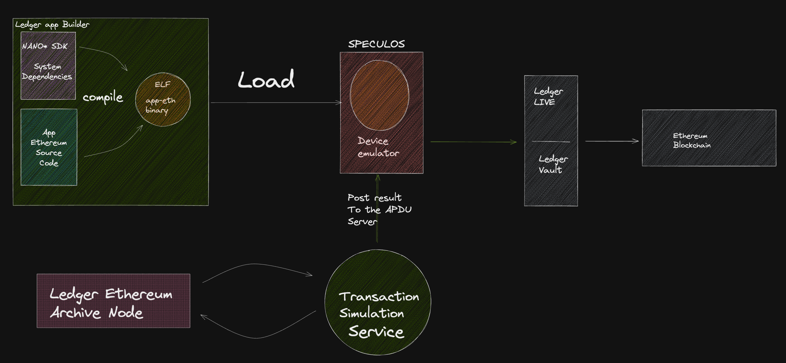
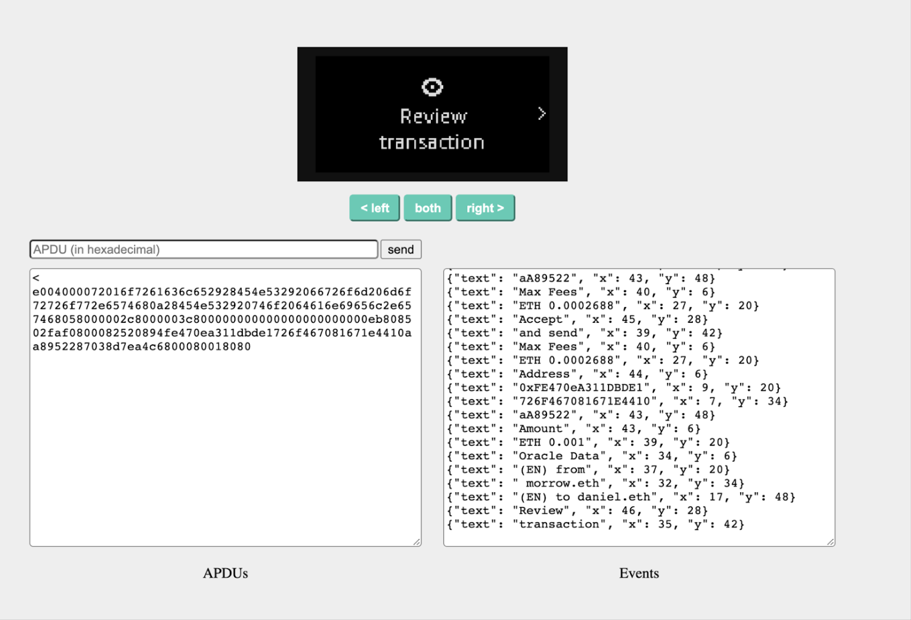

# Welcome to Ledger's Workshop for ETH Bogota :colombia:

Everyone's welcome!

Please feel free to join whether you are an app builder, an Ethereum enthusiast, or a curious flaneur.

## Program

* Build a modified version of the nanoS+ Ethereum app
* Load the binary in [Speculos](https://github.com/LedgerHQ/speculos), the Ledger OS device emulator.
* Simulate some transactions on EVM and print the result on the device screen.

We will run the simulations on the Ledger Ethereum Node for the workshop, but you can use a Quicknode setup or any provider supporting `debug_traceCall`. Read this [blog post](https://blog.ledger.com/the-millennium-problem/) for more information.

## Workshop Architecture

#

## Build the Nano S+ app

1) Build the app builder docker image. The app builder contains the environment mostly nano* SDKs and their dependencies:

    `cd ledger-app-builder && docker build -f Dockerfile<.m1> -t app-builder .`

2) Run the app builder container, mounting the Ethereum nano application to build:

    `sudo docker run --rm -ti -v "</Full/path/to/this/repository>/app-Ethereum-oracle:/app" app-builder`

3) Once inside the app-builder container, compile the nanos+ Ethereum app:

    `BOLOS_SDK=$NANOX_SDK make`

4) Get the binary in your local machine, under the app folder of the Speculos repo:

    `sudo docker cp <container-id>:/app/bin/app.elf speculos/apps/nanos-eth-oracle.elf`

## Load the app binary in Speculos

1) Build Speculos container

    `cd speculos && docker build -t speculos .`

2) Run Speculos container, mounting the apps folder and running the Ethereum app

    `docker run --rm -it -v "$(pwd)"/apps:/speculos/apps -p 1234:1234
     -p 5000:5000 -p 40000:40000 -p 41000:41000 speculos --model nanox ./apps/nanos-eth-oracle.elf --sdk 2.0 --seed "secret" --display headless --apdu-port 40000 --vnc-port 41000`

## Transactions Simulation

1) Run locally the web3-insight project: `cd web3-insight && yarn install && pnpm run start:dev`

2) Explore & Learn from the `devcon-workshop/transactions_simulation` python repository

3) Download workshop dependencies: `pipenv sync`

3) Play with simualtions: `pipenv run main.py`
